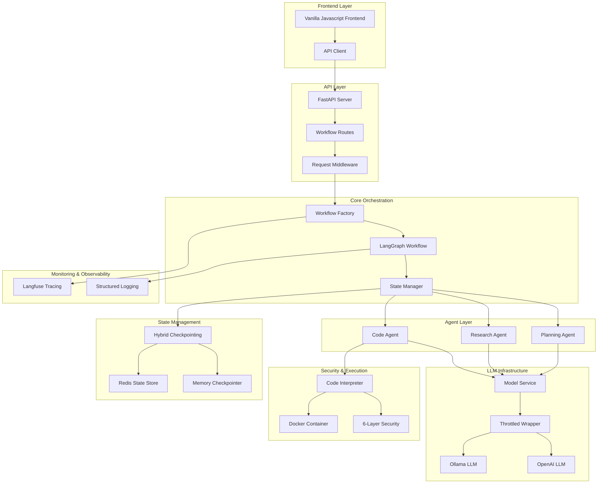

# Clarity.ai Multi-Agent Orchestration System

[](https://python.org)
[](https://fastapi.tiangolo.com)
[](https://langchain.com)
[](https://docker.com)

A sophisticated multi-agent orchestration system that demonstrates advanced backend engineering capabilities through intelligent task decomposition, hybrid state management, and production-ready security architecture. Built with LangChain/LangGraph, FastAPI, and modern MLOps practices.


## DEMO (Add Video Here)
## 🚀 Key Features

### Core Innovations
- **🔄 Hybrid Checkpointing Architecture**: Novel combination of LangGraph memory checkpointing with Redis persistence
- **🛡️ 6-Layer Security System**: Comprehensive code execution protection with AST analysis and sandboxing
- **🧠 Intelligent Task Routing**: Dynamic agent selection based on task classification and dependency analysis

### Agent Capabilities
- **Planning Agent**: Intelligent task decomposition and workflow orchestration
- **Research Agent**: Web research, information synthesis, and analysis
- **Code Agent**: Secure Python code generation and execution with comprehensive safety measures


## 🏗️ System Architecture



## 🛠️ Technology Stack

### Backend
- **Python 3.11+** - Core runtime environment
- **FastAPI** - High-performance async web framework
- **LangChain/LangGraph** - AI agent orchestration and workflow management
- **Redis** - State persistence and caching
- **Docker** - Containerization and secure code execution
- **Pydantic** - Data validation and settings management

### Frontend
- **Vanilla JavaScript** - Lightweight, dependency-free frontend
- **HTML5/CSS3** - Modern web standards
- **Vite** - Fast build tool and development server
- **Axios** - HTTP client for API communication

### AI/ML Infrastructure
- **Ollama** - Local LLM deployment (development)
- **OpenAI API** - Cloud LLM services (testing and production)
- **Langfuse** - LLM observability and tracing
- **Tavily/DuckDuckGo** - Web search capabilities

### Development & Deployment
- **Poetry** - Python dependency management
- **Pytest** - Testing framework
- **Docker Compose** - Multi-container orchestration
- **Structured Logging** - Comprehensive observability

## 🚀 Quick Start

### Prerequisites
- Python 3.11+
- Docker and Docker Compose
- Redis (via Docker)
- Git

### Installation

1. **Clone the repository**
   ```bash
   git clone https://github.com/OmishaPatel/Multi-Agent-Orchestrator.git
   cd multi-agent-orchestrator
   ```

2. **Set up Python environment**
   ```bash
   # Using Poetry (recommended)
   poetry install
   poetry shell
   ```

3. **Configure environment**
   ```bash
   # Copy environment template
   cp .env.sample .env
   
   # Edit .env with your configuration
   # Required: OPENAI_API_KEY, TAVILY_API_KEY (optional)
   ```

4. **Start services**
   ```bash
   # Start Redis and other services
   docker-compose up -d
   
   # Start the application
   python src/main.py
   ```

5. **Access the application**
   - **API**: http://localhost:8000
   - **Frontend**: http://localhost:3000
   - **API Docs**: http://localhost:8000/docs
   - **Health Check**: http://localhost:8000/api/v1/health

## 📖 Usage Examples

### Basic Workflow Execution

```python
import requests

# Submit a research task
response = requests.post("http://localhost:8000/api/v1/run", json={
    "request": "Analyze the latest trends in renewable energy technology"
})

# Check status
status = requests.get(f"http://localhost:8000/api/v1/status/{workflow_id}")
print(status.json())
```

### Code Generation Task

```python
# Submit a code generation task
response = requests.post("http://localhost:8000/api/v1/run", json={
    "request": "Create a compound interest calculator with visualization"
})

# The system will:
# 1. Plan the task (Planning Agent)
# 2. Generate Python code (Code Agent)
# 3. Execute safely in Docker container
# 4. Return results with security validation
```

### Mixed Research and Code Workflow

```python
# Complex multi-agent task
response = requests.post("http://localhost:8000/api/v1/run", json={
    "request": "Research Python web frameworks and create a comparison with code examples"
})

# This will trigger:
# 1. Research Agent: Web research on frameworks
# 2. Planning Agent: Task decomposition
# 3. Code Agent: Generate comparison examples
# 4. All executed with dependency management
```

## 🛡️ Security Features

### 6-Layer Security Architecture

1. **Task Classification** (70% attack surface reduction)
   - Prevents unnecessary code execution
   - Routes non-code tasks to research agents

2. **Static Blacklisting** (95% common attacks blocked)
   - Forbidden imports: `os`, `sys`, `subprocess`, `socket`
   - Forbidden functions: `exec`, `eval`, `compile`, `__import__`

3. **AST Analysis** (Sophisticated bypass prevention)
   - Deep structural code analysis
   - Detects obfuscated attacks and dynamic imports

4. **Pattern Matching** (Complementary protection)
   - Regex-based detection of malicious patterns
   - Catches obfuscation attempts

5. **Runtime Validation** (Last-line defense)
   - Pre-execution security checks
   - Infinite loop and resource abuse detection

6. **Sandboxed Execution** (Complete containment)
   - Docker isolation with resource limits
   - Network disabled, read-only filesystem
   - Non-root user execution

## 🔧 Configuration

### Environment Variables

```bash
# Core Configuration
ENVIRONMENT=development  # development, testing, production
DEBUG=true
LOG_LEVEL=INFO

# API Configuration
API_HOST=0.0.0.0
API_PORT=8000
CORS_ORIGINS=["http://localhost:3000"]

# Redis Configuration
REDIS_URL=redis://localhost:6379
REDIS_PASSWORD=  # Optional

# LLM Configuration
OPENAI_API_KEY=your_openai_key_here
OLLAMA_BASE_URL=http://localhost:11434
LLM_PROVIDER=openai  # openai, ollama, huggingface

# Search Configuration (Optional)
TAVILY_API_KEY=your_tavily_key_here

# Monitoring (Optional)
LANGFUSE_PUBLIC_KEY=your_langfuse_public_key
LANGFUSE_SECRET_KEY=your_langfuse_secret_key
LANGFUSE_HOST=https://cloud.langfuse.com

# Security Configuration
CODE_EXECUTION_TIMEOUT=30
MAX_OUTPUT_SIZE=10000
DOCKER_MEMORY_LIMIT=256m
```

### LLM Provider Configuration

The system supports multiple LLM providers with environment-specific optimization:

#### Development Environment
```python
# Uses local Ollama with throttling
LLM_CONFIG = {
    "provider": "ollama",
    "model": "phi3:mini",
    "base_url": "http://localhost:11434",
    "max_concurrent_requests": 1,
    "request_delay": 0.5
}
```

#### Testing or Production Environment
```python
# Uses OpenAI with optimizations
LLM_CONFIG = {
    "provider": "openai",
    "model": "gpt-4",
    "max_concurrent_requests": 10,
    "retry_attempts": 3,
    "cache_enabled": True
}
```

## 🖥️ Frontend

The frontend is a lightweight, modern web application built with vanilla JavaScript and Vite:

### Features
- **Real-time workflow monitoring** with WebSocket connections
- **Interactive task approval** interface
- **Live execution logs** and progress tracking
- **Responsive design** for desktop and mobile
- **Dark/light theme** support

### Development
```bash
cd frontend
npm install
npm run dev  # Development server on http://localhost:3000
npm run build  # Production build
npm run preview  # Preview production build
```

### Frontend Architecture
```
frontend/
├── src/
│   ├── js/
│   │   ├── api.js          # API client
│   │   ├── websocket.js    # Real-time updates
│   │   └── main.js         # Application logic
│   ├── css/
│   │   └── styles.css      # Styling
│   └── index.html          # Main HTML
├── public/                 # Static assets
└── vite.config.js         # Build configuration
```

## 📊 Monitoring & Observability

### Langfuse Integration
- **Trace Collection**: Complete workflow execution traces
- **Performance Metrics**: Token usage, latency, cost tracking
- **Error Monitoring**: Detailed error analysis and debugging

### Structured Logging
```python
# Comprehensive logging throughout the system
logger.info("Workflow started", extra={
    "workflow_id": thread_id,
    "user_request": request,
    "agent_type": "planning"
})
```

## 🧪 Testing

### Integration Tests Setup

The project includes comprehensive integration tests that verify end-to-end functionality across different components. Follow these steps to run integration tests:

#### Prerequisites for Integration Tests

1. **Start Required Services**
   ```bash
   # Start Redis (required for state management tests)
   docker-compose up -d redis
   
   # Start Ollama server (for LLM integration tests)
   ollama serve
   ```

2. **Install Required Models**
   ```bash
   # Pull required Ollama models for testing
   ollama pull phi3:mini
   ollama pull llama3.2:1b
   ollama pull qwen2:0.5b
   ```

3. **Configure Test Environment**
   ```bash
   # Copy test environment configuration
   cp .env.testing .env
   
   # Or add these variables to your existing .env:
   TEST_OLLAMA=true
   OLLAMA_BASE_URL=http://localhost:11434
   REDIS_URL=redis://localhost:6379
   ENVIRONMENT=testing
   ```

#### Running Integration Tests

1. **Check Test Readiness**
   ```bash
   # Verify all services are ready for testing
   cd tests/integration/llm_integration
   python check_test_readiness.py
   ```

2. **Run All Integration Tests**
   ```bash
   # From project root
   pytest tests/integration/ -v
   
   # Run with coverage
   pytest tests/integration/ --cov=src --cov-report=html -v
   ```

3. **Run Specific Integration Test Categories**
   ```bash
   # API Integration Tests
   pytest tests/integration/test_api_integration.py -v
   
   # Workflow Integration Tests
   pytest tests/integration/test_workflow_integration.py -v
   
   # Redis State Management Tests
   pytest tests/integration/test_redis_state_recovery.py -v
   pytest tests/integration/test_redis_cleanup_integration.py -v
   
   # LLM Integration Tests
   pytest tests/integration/llm_integration/ -v
   
   # Model Router Tests
   pytest tests/integration/test_model_router_integration.py -v
   ```

4. **Run End-to-End Tests**
   ```bash
   # Complete workflow tests
   pytest tests/integration/e2e/ -v
   
   # Interactive manual testing
   python tests/integration/e2e/interactive_manual_tester.py
   ```

#### Expected Integration Test Results

**Pre-flight Check Output:**
```
Checking Integration Test Environment...
==================================================
Environment: testing
Test Timeout: 60s
Ollama Tests: [ENABLED]
Redis Tests: [ENABLED]
API Tests: [ENABLED]

Checking Services...
[OK] Redis is running at redis://localhost:6379
[OK] Ollama is running at http://localhost:11434

Checking Models...
  [OK] phi3:mini
  [OK] llama3.2:1b
  [OK] qwen2:0.5b

==================================================
[SUCCESS] All services are ready for integration testing!
```

**Integration Test Categories:**
```bash
# API Integration Tests
test_api_integration.py::TestAPIIntegration::test_health_endpoint PASSED
test_api_integration.py::TestAPIIntegration::test_workflow_creation PASSED
test_api_integration.py::TestAPIIntegration::test_workflow_status PASSED

# Workflow Integration Tests  
test_workflow_integration.py::TestWorkflowIntegration::test_complete_workflow PASSED
test_workflow_integration.py::TestWorkflowIntegration::test_workflow_state_persistence PASSED
test_workflow_integration.py::TestWorkflowIntegration::test_workflow_error_recovery PASSED

# Redis Integration Tests
test_redis_state_recovery.py::TestRedisStateRecovery::test_state_persistence PASSED
test_redis_cleanup_integration.py::TestRedisCleanup::test_cleanup_expired_workflows PASSED

# LLM Integration Tests
test_ollama_integration.py::TestOllamaIntegration::test_ollama_basic_generation PASSED
test_llm_integration.py::TestLLMIntegration::test_retry_logic_integration PASSED
test_llm_integration.py::TestLLMIntegration::test_caching_integration PASSED
```